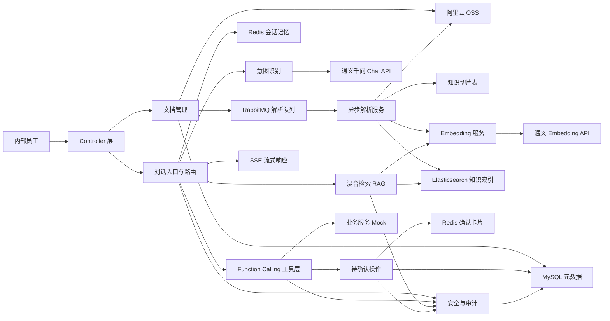
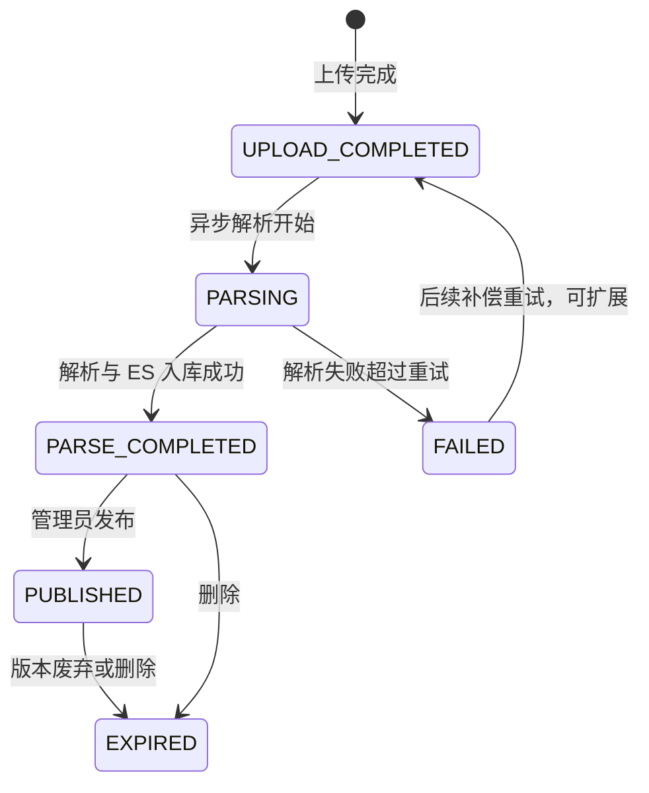
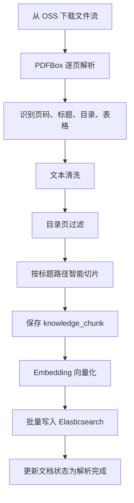
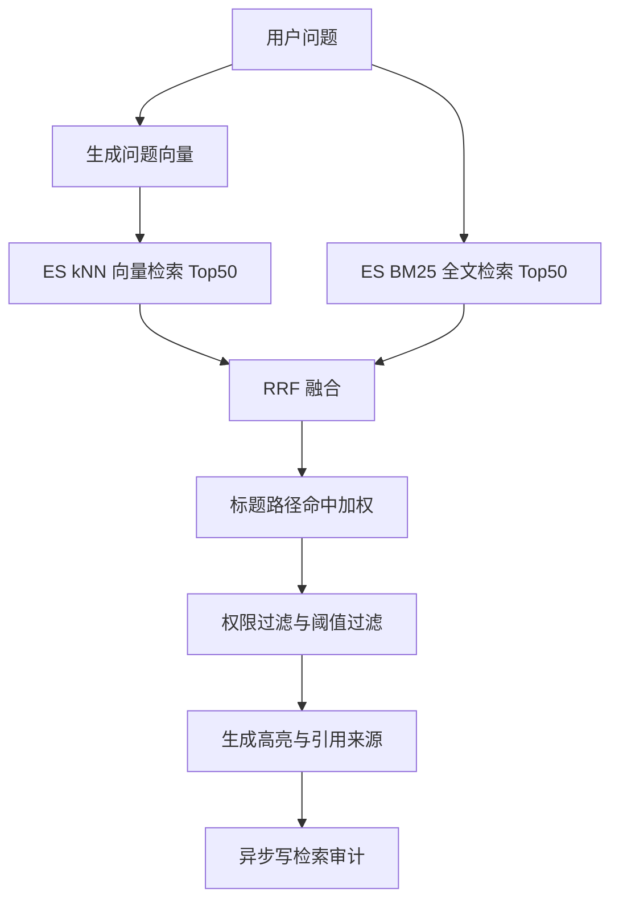
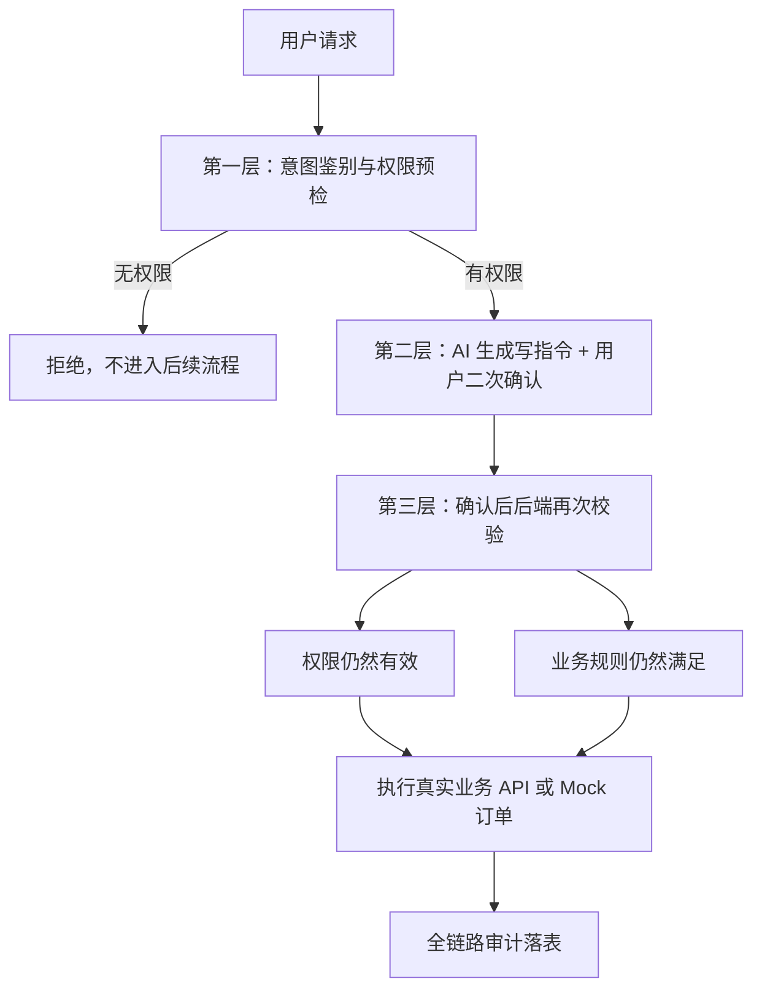

# 银行内部 AI 企业智能助手详细设计文档与后续完善计划

## 1. 项目定位

本项目是面向银行内部员工的 AI 企业智能助手，核心目标是让员工通过自然语言完成两类工作：

- 制度问答：围绕制度文件、操作手册、FAQ 等知识库内容进行可信问答，并提供引用溯源。
- 办公办理：围绕请假、薪资、审批、外包入场等业务场景进行查询和办理，写操作必须经过二次确认和后端安全校验。

系统采用 Spring Boot 单体服务作为当前实现形态，内部按领域拆分为文档管理、异步解析、向量检索、对话路由、工具调用、会话记忆、安全沙箱和审计对账等模块。后续可以按领域边界拆分为独立服务。

## 2. 技术栈

| 类别 | 技术 |
| --- | --- |
| 后端框架 | Spring Boot 3.3.5、JDK 17 |
| 持久化 | MyBatis、Spring JDBC 事务、MySQL |
| 文件存储 | 阿里云 OSS |
| 消息队列 | RabbitMQ |
| 缓存与会话 | Redis |
| 搜索引擎 | Elasticsearch 8.x、IK 分词器、dense_vector |
| 大模型 | 通义千问 Qwen，OpenAI 兼容接口 |
| Embedding | 通义 text-embedding-v2，1536 维向量 |
| AI 框架 | Spring AI、LangChain4j |
| PDF 解析 | PDFBox、Tabula、Tess4J |
| 安全 | Spring Security、方法级权限、Mock 用户上下文 |
| 工具库 | Lombok、Validation、Java HttpClient |

## 3. 总体架构

## 4. 模块设计

### 4.1 文档管理模块

主要代码位置：

- `com.bank.aiassistant.document.controller`
- `com.bank.aiassistant.document.service`
- `com.bank.aiassistant.document.dto`
- `com.bank.aiassistant.oss`

核心能力：

- 上传 PDF、DOC、DOCX 文件。
- 通过 SHA-256 文件哈希做去重。
- 按 `knowledge-base/{tenantId}/{yyyy/MM}/{docId}-{fileName}` 生成 OSS 路径。
- 保存文档元数据到 `ai_document`。
- 上传成功后发送 RabbitMQ 解析消息。
- 支持下载临时 URL、文档详情、分页列表、业务元数据更新、软删除。
- 支持版本列表、发布、废弃、待发布列表。

事务一致性策略：

- 文件上传方法使用 `@Transactional`。
- OSS 上传失败时抛出异常，数据库事务回滚。
- OSS 上传成功但数据库保存失败时，清理已上传 OSS 对象。
- RabbitMQ 消息在事务提交后发送，发送失败只记录日志，不影响上传结果。

状态流转：

### 4.2 OSS 存储模块

主要代码位置：

- `OssConfig`
- `OssProperties`
- `OssService`
- `OssUploadResult`
- `FileHashUtils`

能力设计：

- 从配置读取 endpoint、accessKey、secret、bucket。
- 上传文件，返回 OSS 对象路径、ETag、访问 URL。
- 下载对象，返回输入流。
- 生成 5 分钟临时签名 URL。
- 删除文件。
- 判断文件是否存在。
- 计算 MultipartFile 或 InputStream 的 SHA-256。

### 4.3 异步解析模块

主要代码位置：

- `document.message`
- `document.parse`
- `document.parse.pdf`

RabbitMQ 设计：

| 类型 | 用途 |
| --- | --- |
| Direct Exchange | 文档解析主交换机 |
| 主队列 | 接收解析任务，手动 ACK |
| DLX | 解析失败死信交换机 |
| DLQ | 超过重试次数后的失败任务 |

消息体 `DocumentParseMessage` 包含：

- 文档 ID
- 操作人 ID
- 操作人姓名
- 触发时间
- 当前重试次数
- 最大重试次数

消费策略：

- 手动 ACK。
- 幂等处理：已处于解析中、解析完成、已发布等状态时跳过。
- 解析失败时按最大 3 次重试控制。
- 超过重试次数后进入死信队列并标记文档失败。

### 4.4 PDF 解析、清洗与切片模块

主要代码位置：

- `PdfDocumentParser`
- `PdfStructureExtractor`
- `PdfTextCleaner`
- `PdfChunker`
- `PdfOcrService`
- `PositionAwarePdfTextStripper`

解析流程：

切片策略：

- 优先以标题作为切片边界。
- 每个切片携带完整章节路径。
- 目标长度 500 到 1000 字。
- 超长内容在段落边界二次切分。
- 相邻切片保留约 150 字重叠。
- 表格转换为 Markdown 并单独切片。
- 目录页不生成切片。

当前限制：

- DOC、DOCX 的解析流程尚未真正实现。
- 表格识别是基础能力，复杂跨页表格仍需加强。
- OCR 默认关闭，需要真实 tessdata 和运行环境验证。

### 4.5 向量化与 Elasticsearch 模块

主要代码位置：

- `embedding`
- `search`
- `config.ElasticsearchClientConfig`

ES 索引设计：

索引名由 `app.ai.elasticsearch.chunk-index-name` 配置，默认 `bank-ai-document-chunk`。

核心字段：

- 过滤字段：chunkId、documentId、documentName、documentType、versionNo、department、confidentialityLevel、status、latestVersion。
- 全文检索字段：content，使用 IK max_word。
- 标题路径字段：chapterPath，使用 IK smart。
- 向量字段：embedding，dense_vector，1536 维，cosine similarity。
- 溯源字段：chapterNo、chunkSeq、startPage、endPage、effectiveTime、createdTime。

入库策略：

- 切片保存数据库后，批量调用 Embedding。
- 每批最多 100 条。
- Embedding 失败自动重试 3 次。
- 使用 ES BulkRequest 批量写入。
- ES 写入成功后才更新文档状态为解析完成。
- 部分失败记录日志并返回失败列表，由解析流程决定是否重试。

版本处理：

- 新版本发布后，旧版本文档状态和 ES 切片标记为已过期。
- 查询默认只检索 `status=PUBLISHED` 且 `latestVersion=true` 的切片。

### 4.6 RAG 在线检索模块

主要代码位置：

- `retrieval`
- `security.PermissionFilterService`

检索流程：

混合检索规则：

- 向量检索和 BM25 检索各取 Top 50。
- 使用 RRF 倒数排名融合：`score = Σ 1 / (60 + rank)`。
- 标题路径命中问题关键词时增加权重。
- 低于阈值的结果不返回。
- 空结果返回低置信提示。

权限过滤：

- 仅检索已发布文档。
- 仅检索最新版本。
- 公开：所有用户可见。
- 内部：登录用户可见。
- 机密：需要机密访问角色。
- 秘密：需要秘密访问角色。
- 部门文档仅允许本部门可见，管理员可见全部。

审计监控：

- 记录用户 ID、问题、命中数、耗时、文档 ID、最高分。
- 标记低置信检索。
- 提供高频查询和低命中查询统计。

### 4.7 对话入口与意图路由模块

主要代码位置：

- `dialog`
- `llm`

入口接口：

- 普通对话：`/api/assistant/chat`
- 流式对话：`/api/assistant/chat/stream`

意图类型：

| 意图 | 处理链路 |
| --- | --- |
| POLICY_QA | RAG 检索 + 大模型回答 |
| BUSINESS_QUERY | Function Calling 读工具 |
| BUSINESS_EXECUTE | Function Calling 写工具 + 二次确认 |
| CHITCHAT | 直接大模型对话 |
| AMBIGUOUS | 返回追问 |

会话状态优先级：

- 如果 Redis 会话状态为等待补槽，则优先走槽位填充。
- 如果 Redis 会话状态为等待确认，则优先走确认或取消处理。
- 其他情况才进入意图识别。

意图识别策略：

- 优先调用 Qwen，要求输出结构化 JSON。
- 同一会话内相同问题缓存 5 分钟。
- 超时或失败时使用关键词规则兜底。
- 默认兜底到 POLICY_QA，避免误执行写操作。

### 4.8 Function Calling 工具模块

主要代码位置：

- `tool.BankBusinessTools`
- `dialog.BusinessFunctionCallingGateway`
- `business`

已定义工具：

| 领域 | 工具 | 类型 |
| --- | --- | --- |
| 请假 | 创建请假单 | WRITE |
| 请假 | 查询假期余额 | READ |
| 请假 | 查询请假记录 | READ |
| 薪资 | 查询薪资明细 | READ |
| 薪资 | 查询薪资历史 | READ |
| 审批 | 查询审批进度 | READ |
| 审批 | 查询待办列表 | READ |
| 审批 | 提交审批意见 | WRITE |
| 外包 | 创建外包入场申请 | WRITE |
| 外包 | 查询外包申请进度 | READ |

执行规则：

- READ 工具通过权限校验后直接返回查询结果。
- WRITE 工具不直接执行业务，生成待确认操作。
- 工具调用前读取 SecurityContext 当前用户。
- 工具内部进行参数校验，失败时返回结构化错误。
- 每次工具调用异步写审计日志。

当前业务 Service 均为 Mock 实现，后续需要接入真实 HR、薪资、审批、外包管理系统。

### 4.9 SSE 流式对话与会话记忆

主要代码位置：

- `StreamingDialogService`
- `QwenStreamingChatService`
- `SseEventSender`
- `RedisConversationMemoryService`

SSE 事件：

| 事件 | 含义 |
| --- | --- |
| message | 模型文本 token |
| tool_start | 工具调用开始 |
| tool_result | 工具调用完成 |
| confirm_required | 需要二次确认 |
| done | 回答结束 |
| error | 异常 |

会话记忆：

- Redis key 绑定 `userId + conversationId`。
- 保存最近 20 条消息。
- 保存当前意图、已填槽位、缺失槽位、待确认操作 ID、会话状态。
- 30 分钟无活动自动过期。

写操作确认：

- WRITE 工具生成待确认指令。
- Redis 保存确认卡片，TTL 5 分钟。
- MySQL 保存 `ai_pending_operation`。
- 用户确认后再次执行安全校验，再生成业务订单记录。
- 用户取消或超时后丢弃指令。

### 4.10 安全沙箱与审计模块

主要代码位置：

- `security`
- `tool.ConfirmationExecutionService`

三层安全架构：

权限维度：

- 用户角色。
- 是否查询本人数据。
- HR 等角色的数据范围。
- 部门范围。
- 特殊密级访问能力。

防绕过设计：

- 写操作真实业务 API 不直接暴露给前端。
- 前端只能调用确认或取消接口。
- 确认接口内部校验 Redis 待确认指令是否存在。
- 校验当前用户是否为指令创建者。
- 校验当前用户仍有操作权限。
- 校验业务规则后才执行。

审计覆盖：

- 意图识别。
- RAG 检索。
- 工具调用。
- 确认、取消、执行。
- 安全拒绝。
- 零误操作对账。

敏感数据脱敏：

- 薪资金额脱敏为 `****`。
- 身份证等证件号脱敏。
- 审计日志保存脱敏后的参数。

### 4.11 数据库设计摘要

核心表：

| 表 | 用途 |
| --- | --- |
| `ai_document` | 文档主表，保存文件、OSS、业务元数据、状态与审计字段 |
| `knowledge_chunk` | 文档切片表，保存切片文本、章节路径、页码、token 数 |
| `ai_conversation_message` | 对话历史表 |
| `ai_pending_operation` | AI 生成的待确认写操作 |
| `ai_tool_call_audit` | 工具调用审计 |
| `ai_retrieval_audit_log` | 检索行为审计 |
| `ai_security_audit_log` | 全链路安全审计 |
| `ai_business_order` | AI 确认执行后的业务订单对账表 |

重要索引：

- 文档状态、类型、部门、生效时间、发布时间、上传人。
- 文件哈希唯一索引用于去重。
- 切片文档 ID + 序号联合索引。
- 对话按会话、用户时间索引。
- 待确认操作按用户状态、过期时间索引。
- 审计日志按用户时间、动作类型、拒绝标记索引。

## 5. 对外接口摘要

### 5.1 文档接口

| 接口 | 方法 | 说明 |
| --- | --- | --- |
| `/api/documents` | POST | 上传文档 |
| `/api/documents/{docId}` | GET | 查询文档详情 |
| `/api/documents` | GET | 分页查询文档 |
| `/api/documents/{docId}` | PUT | 更新业务元数据 |
| `/api/documents/{docId}` | DELETE | 软删除文档 |
| `/api/documents/{docId}/download-url` | GET | 生成临时下载 URL |
| `/api/documents/{displayName}/versions` | GET | 查询历史版本 |
| `/api/documents/pending-publish` | GET | 查询待发布列表 |
| `/api/documents/{docId}/publish` | POST | 发布文档 |
| `/api/documents/{docId}/expire` | POST | 废弃文档 |

### 5.2 检索接口

| 接口 | 方法 | 说明 |
| --- | --- | --- |
| `/api/ai/retrieval` | POST | 在线混合检索 |
| `/api/ai/retrieval/stats/high-frequency` | GET | 高频查询统计 |
| `/api/ai/retrieval/stats/low-hit` | GET | 低命中查询统计 |

### 5.3 对话接口

| 接口 | 方法 | 说明 |
| --- | --- | --- |
| `/api/assistant/chat` | POST | 非流式对话 |
| `/api/assistant/chat/stream` | POST | SSE 流式对话 |
| `/api/assistant/confirm/{pendingId}` | POST | 确认写操作 |
| `/api/assistant/confirm/{pendingId}/cancel` | POST | 取消写操作 |

## 6. 配置设计

`application.yml` 已覆盖：

- 服务端口。
- MySQL 数据源。
- MyBatis。
- 文件上传限制。
- RabbitMQ。
- Redis。
- Elasticsearch。
- Spring AI OpenAI 兼容配置。
- Qwen Chat 与 Embedding。
- LangChain4j。
- 阿里云 OSS。
- 文档解析队列。
- PDF 解析参数。
- 混合检索参数。
- 对话 Prompt 模板。
- 安全对账定时任务。

敏感信息均通过环境变量注入，例如：

- `QWEN_API_KEY`
- `ALIYUN_OSS_ACCESS_KEY_ID`
- `ALIYUN_OSS_ACCESS_KEY_SECRET`
- `MYSQL_PASSWORD`
- `ELASTICSEARCH_PASSWORD`
- `REDIS_PASSWORD`

## 7. 当前已完成能力

- 数据模型与 MyBatis Mapper。
- OSS 上传、下载、签名 URL、删除、存在性检查。
- 统一响应与全局异常处理。
- Qwen、Embedding、LangChain4j、Spring AI 基础配置。
- 文档上传、去重、列表、元数据更新、软删除。
- RabbitMQ 异步解析框架、手动 ACK、重试、死信。
- PDF 解析、清洗、切片与入库。
- DOC、DOCX 基础解析、标题识别和 DOCX 表格抽取。
- 切片质量评分，低质量切片入库留痕但不写入 ES。
- 管理端解析补偿、文档索引重建和切片预览接口。
- Embedding 生成与 ES Bulk 入库。
- 文档版本发布与旧版本过期。
- ES 检索权限过滤。
- RAG 混合检索、RRF 融合、引用溯源、检索审计。
- 意图识别、会话路由、规则兜底。
- Function Calling 工具层。
- SSE 流式响应。
- Redis 多轮会话记忆。
- 写操作二次确认。
- 三层安全沙箱。
- 全链路审计与敏感字段脱敏。
- 零误操作对账基础能力。

## 8. 当前主要不足

### 8.1 工程质量

- 缺少单元测试、集成测试、端到端测试。
- 缺少 Testcontainers 驱动的 MySQL、Redis、RabbitMQ、ES 测试环境。
- 当前编译通过依赖本机 JDK 17 + Maven 3.6.3，需固化到 Maven Wrapper 或 CI 镜像。
- 部分早期中文配置和 SQL 注释存在编码显示异常，需要统一 UTF-8 清理。
- 数据库迁移仍依赖 `schema.sql`，缺少 Flyway 或 Liquibase。

### 8.2 生产可用性

- 真实 SSO、组织架构、角色权限、数据权限尚未接入。
- 真实业务系统尚未接入，当前请假、薪资、审批、外包均为 Mock。
- 缺少真实环境下的 RabbitMQ、Redis、ES、OSS、Qwen 连通性验证。
- 缺少限流、熔断、降级、重放保护和请求幂等键。
- 缺少全局追踪 ID、链路追踪、指标监控和告警。

### 8.3 RAG 效果

- PDF 复杂表格、页眉页脚、目录识别仍需要真实样本调优。
- DOC、DOCX 解析尚未实现。
- OCR 未完成生产级验证。
- 缺少召回评测集、答案评测集和人工标注闭环。
- 缺少重排序模型，例如 bge-reranker 或通义 rerank。
- 缺少知识库增量更新、失败补偿、索引重建任务。

### 8.4 对话体验

- 槽位填充目前是基础实现，复杂多轮业务表单仍需增强。
- Function Calling 与真实 LangChain4j/Spring AI 自动工具调用链路还可以进一步收敛。
- SSE 断线恢复、前端事件协议版本、客户端重试策略尚未设计完整。
- 缺少对话历史持久化落库闭环。

### 8.5 安全合规

- 当前用户上下文是 Mock，安全结论只能用于开发阶段。
- 审计日志需要进一步定义留存周期、归档、不可篡改、防抵赖。
- 敏感字段识别规则需要银行真实字段字典支撑。
- 缺少 Prompt 注入防护、越权检索攻击检测、工具调用参数白名单策略。
- 缺少模型输出安全审核，例如涉密、隐私、幻觉风险提示。

## 9. 后续完善计划

### 阶段一：工程基线与可运行环境

目标：让项目从“能编译”提升到“可稳定本地启动、可自动测试”。

- 增加 Maven Wrapper，固定 Maven 版本。
- 增加 `.java-version` 或开发环境说明，固定 JDK 17。
- 引入 Flyway 或 Liquibase，替代手工维护 `schema.sql` 的建表方式。
- 修复 `application.yml` 和 `schema.sql` 的中文编码异常。
- 增加 Docker Compose：MySQL、Redis、RabbitMQ、Elasticsearch、Kibana。
- 增加启动说明、环境变量说明、索引初始化说明。
- 增加基础单元测试：文件校验、哈希、权限过滤、RRF 融合、脱敏。
- 增加集成测试：文档上传、消息发送、检索流程、确认执行。

### 阶段二：知识库生产化

目标：提升文档解析质量、索引稳定性和知识更新能力。

- 已实现 DOC、DOCX 基础解析。
- 已实现 DOCX 表格抽取并转换为 Markdown 切片。
- 已实现切片质量评分和低质量切片过滤。
- 已实现解析失败补偿接口。
- 已实现按文档重建 ES 索引能力。
- 已实现管理员侧切片预览接口。
- 基于银行真实制度样本调优 PDF 标题识别、页眉页脚过滤、目录识别。
- 完善 Tabula 表格抽取，支持跨页表格合并。
- 完善 OCR 兜底，支持扫描版 PDF 队列隔离和长任务处理。
- 增加按版本重建索引、全量重建索引能力。
- 增加管理员侧解析预览接口。

### 阶段三：RAG 效果增强

目标：让制度问答更准确、更可解释、更容易持续优化。

- 引入 reranker，对 RRF 结果二次排序。
- 增加 Query Rewrite 和多查询扩展。
- 增加同义词词库、银行术语词典和 ES IK 自定义词典。
- 增加引用强约束回答策略，未命中依据时严格拒答。
- 建立 RAG 评测集，覆盖制度问答、流程问答、表格问答、跨文档问答。
- 建立低命中问题到知识补全任务的闭环。
- 增加答案满意度反馈接口。
- 增加检索可观测面板：召回耗时、Embedding 耗时、ES 耗时、命中分布。

### 阶段四：真实身份权限与业务系统接入

目标：从 Mock 办理升级为真实企业业务办理。

- 接入银行统一认证 SSO。
- 接入组织架构、岗位、角色、部门、数据权限服务。
- 替换 `MockSecurityContextFilter` 和 `MockCurrentUserProvider`。
- 将请假、薪资、审批、外包 Mock Service 替换为真实内部 API。
- 为每个 WRITE 工具定义幂等键、业务流水号和回滚策略。
- 对工具参数建立严格 JSON Schema 校验。
- 建立工具调用白名单和环境隔离。
- 为跨系统调用增加超时、重试、熔断和补偿。

### 阶段五：对话体验与前端协议完善

目标：提升多轮办理的自然度和前端可集成性。

- 完善槽位填充状态机，支持复杂表单、多对象、多时间段。
- 增加会话历史落库与会话列表接口。
- 增加 SSE 断线重连和事件 replay。
- 固化前端事件协议版本。
- 增加确认卡片 schema，支持表单式确认、差异确认、风险提示。
- 增加用户可编辑参数后再确认的流程。
- 增加“撤销最近待确认指令”能力。

### 阶段六：安全合规增强

目标：满足银行内控、审计和合规要求。

- 增加 Prompt 注入检测和检索内容可信边界提示。
- 对工具调用参数做 allowlist 校验和危险值检测。
- 增加敏感数据分类分级字典。
- 审计日志接入不可篡改存储或日志平台。
- 增加审计查询、导出、留存和归档策略。
- 增加 AI 操作日报、周报和异常行为告警。
- 增加模型输出安全审核。
- 增加涉密文档召回和回答水印策略。

### 阶段七：性能与高可用

目标：满足企业内部高并发和稳定性要求。

- 对文档解析、Embedding、ES Bulk 入库做并发和背压控制。
- 对检索接口增加本地缓存和热点问题缓存。
- 对 Qwen 调用增加连接池、超时、熔断和 fallback。
- 对 RabbitMQ 增加消费线程、预取数量和队列堆积监控。
- 对 SSE 连接增加连接数限制和资源释放监控。
- 引入 Micrometer、Prometheus、Grafana。
- 引入 OpenTelemetry 链路追踪。
- 设计多实例部署下的 Redis 锁和任务幂等策略。

## 10. 推荐优先级

近期最建议优先处理：

1. 固化 JDK 17 和 Maven Wrapper，避免环境不一致导致编译失败。
2. 引入 Flyway，修复 SQL 和配置文件中文编码。
3. 增加 Docker Compose 和集成测试，让完整链路可重复验证。
4. 替换 Mock 用户为真实认证前的可配置 Mock，便于测试多角色权限。
5. 增加 RAG 评测集，开始用真实制度样本调优切片和召回。
6. 将 Function Calling 工具参数改为严格 JSON Schema，并补充负面测试。

## 11. 交付检查清单

- 编译：使用 JDK 17 和 Maven 3.6.3，当前项目可通过 `mvn -DskipTests compile`。
- 配置：敏感信息通过环境变量注入。
- 数据库：核心表已设计，后续建议迁移到 Flyway。
- 消息：解析队列具备手动 ACK、重试和死信。
- 检索：具备 BM25 + kNN + RRF + 权限过滤。
- 对话：具备意图识别、路由、SSE、会话记忆。
- 安全：具备二次确认、三层校验、审计和对账基础能力。
- 待补齐：测试、真实系统接入、生产级权限、可观测性、RAG 评测闭环。
